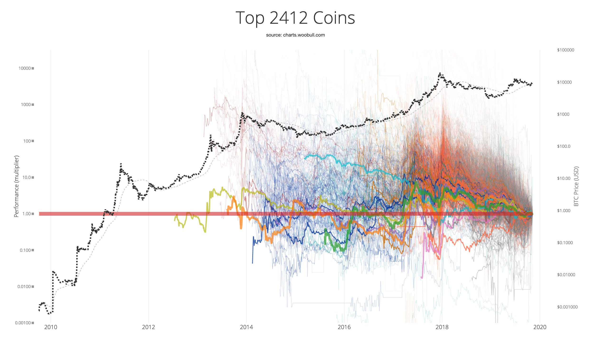
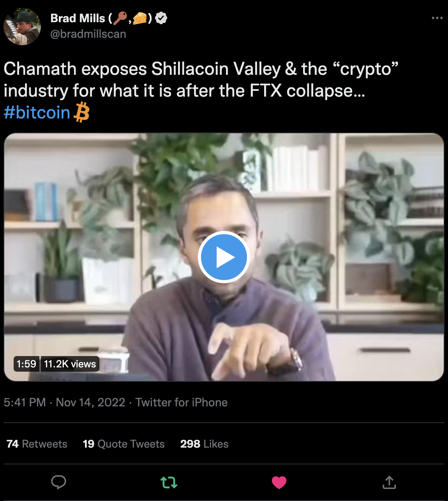

# A Bitcoin Maximalist's Manifesto

##### Open Sourced by [@alphaazeta](https://twitter.com/alphaazeta)
##### Source Code at [GitHub]()

> It seemed so obvious to me; Here we are faced with the problems of loss of privacy, creeping computerization, massive databases, more centralization - and Chaum offers a completely different direction to go in, one which puts power into the hands of individuals rather than governments and corporations. The computer can be used as a tool to liberate and protect people, rather than to control them.
> -- <cite>[Hal Finney, 1992, Cypherpunks Mailing List](https://cryptoanarchy.wiki/people/hal-finney)</cite>

Bitcoin Maximalists advocate that Bitcoin is and always will be the only true digital asset. All other assets are inferior distractions; most are scams that eventually will fade away. This conclusion is based on observation and experience coming from some fundamental principals.

### Never Trust. Always Verify.

At the core of the digital asset revolution is the belief that one should never trust but rather verify the information. All code should be, by definition, open source or you are required to trust a third party.

> Trusted Third Parties are Security Holes
> -- <cite>[Nick Szabo, 2001](https://nakamotoinstitute.org/trusted-third-parties/)</cite>

Bitcoin [Code is open source](https://github.com/bitcoin/bitcoin) and is posted publicly online. Anyone is free to use the code for their own purposes, scrutinize it for bugs or propose new changes or features. This means that it can be verified by anyone. For example, it is very easy to verify the 21mm [maximum amount of issuance.](https://bitcoin.stackexchange.com/questions/69492/btc-source-code-amount-h-file) and ensure that the software running on my own node is enforcing and validating these rules.

### Running a Full Node

Running a full node means that you can independently verify the full history of transactions. It means that your node validated every single transaction in the past and that it is enforcing that same set of rules today and to the future. By running a node you have full control and ensure that all the rules are being followed.

> In this sense, nodes are more important than hash power as they are the ones that verify that the blockchain is following the rules. Even with the longest Proof-of-Work chain, nodes will still determine if said chain follows the rules and whether or not it is accepted or ignored.
> -- <cite>[Bitcoinist | 6 reasons to run a Bitcoin Node](https://bitcoinist.com/6-reasons-run-bitcoin-full-node/)</cite>

It also means that, once again, you are not trusting a third party to broadcast and view your transactions which is also a huge privacy enhancement.

Some Node projects are making this process easier every day.

### In a world of Open Source Code, every good idea can be copied while bad ideas will be avoided.

Remember we mentioned that, by definition, projects need to be open source. This means there are no secrets. Every clever piece of code, every bug, every exploit, every feature -- it's all there. Visible to everyone.

This means that every good code feature contained in the Bitcoin code can be replicated by other systems. And vice-versa. Let's suppose for example that someone comes up a new coin that is able to secure transactions 100x better than Bitcoin with no tradeoffs. That piece of code will be immediately available to be copied and merged into Bitcoin's code. Zero barriers.

It also means that Bitcoin developers can learn from the mistakes of other projects. Litecoin for example, [implemented SegWit before Bitcoin](https://blog.bitmex.com/the-blocksize-war-chapter-16-litecoin/). Every altcoin therefore is a testnet for Bitcoin testing new features that could prove too risky for Bitcoin to implement straight away. And if they succeed, they could be implemented if there's consensus.

### Security and Reliability should come first

To become the world's global reserve this is paramount.
With great power comes great responsibility. Bitcoin cannot be running after every new innovation and trying to replicate the new shiny thing. The risks far outweigh the potential rewards. This is a feature, not a bug.

The one thing that sets it apart from every single altcoin is Immutability. This is why proof-of-stake will eventually fail. It is cursed to be captured at some point.

### Network effects

Approach Bitcoin with as much humility as you can. With time you will learn that what you don't know will always be greater than what you know. Yes, always.

This is due to two main reasons:

First, Bitcoin is a subject that requires understanding of very different areas of knowledge. At first, the tendency is to approach it from a couple of dimensions we have experience with. For example, an Economist may first question why Bitcoin is money; a computer scientist may question if SHA256 can be broken while a politician may question if Governments can ban it.

To fully understand Bitcoin one would need to fully understand:

- Economics (Macroeconomics, Microeconomics, Human Action, etc.)
- Game Theory
- Political Sciences
- Law and Regulations
- Computer Science (cryptography, networking, security, etc.)
- Physics (thermodynamics, conservation of energy, etc.)
- Energy production, distribution and consumption
- Marketing
- History
- Philosophy

This brings to the second reason. No human being can expect to be an expert in all these fields. No matter how smart and dedicated. Our lifespans and mind-bandwidths are just too short. You may think you are an expert but you just don't know what you don't know.

If the code is available to be forked by other projects what makes Bitcoin unique?

### Antifragility and the Honey Badger

Honey badger don't care

### Genesis happens once. And only once.

As mentioned, Bitcoin’s code is completely open source. It can and has been forked several times. The code is not what gives Bitcoin immutability and value. What does is the unique circumstances by which it was created. This is not replicable. It can only happen once and it has already happened.

### Bad money drives out good

Gresham's law is a monetary principle stating that "bad money drives out good." It is primarily used for consideration and application in currency markets. Gresham's law was originally based on the composition of minted coins and the value of the precious metals used in them.

Bitcoin is the only monetary network that allows money to travel through time and space with very little cost. Gold, for example, is great to store value through time - a bar of gold will last thousands of years. But it's terrible to move through space. Many are the examples of gold being stolen while being transported since the early days of horse waggons to ships being attacked by pirates. This led to the development of deposit notes - a claim to gold somewhere.

A piece of paper can be taken easily anywhere. But guaranteing that

### Lessons from the past

Altcoins tend to zero. The attached chart by Willy Woo summarizes the performance of altcoins compared to Bitcoin and demonstrates well this point. [Original Tweet here](https://twitter.com/woonomic/status/1192316072533229568).

### Incentives and Conflicts of Interest

Smell the conflict of interest. Always question the incentives. Why is
someone doing something? What is their motivation? Are they conflicted?

Here's a [prime example](https://twitter.com/bradmillscan/status/1592256453171351552?s=46&t=toM4y8Hh15adE2VDTG2flA) on why altcoins are so popular. It has little to do with technology and everything to do with incentives. At the end, the less informed pays the bill.

### Custody Minimalism

<strong>Only leave at Exchanges what you are willing to lose.
It is critical that you store your Bitcoins in your own wallets and hold your keys.</strong>

Exchanges are closed source. Several layers of trust are required:

- Trust that they are not lending your assets to others (fractional reserve);
- Trust that they are not committing fraud. Examples: FTX's Sam Bankman-Fried;
- Trust that they have good governance around key management (who can sign transactions, cold vs hot wallets, etc.). Examples: [QuadrigaCx](https://internalauditor.theiia.org/en/articles/2019/april/the-single-point-of-failure/);
- Trust that their technology is resilient against hackers (exchanges are massive honey pots). Example: [Mt. Gox and others](https://selfkey.org/list-of-cryptocurrency-exchange-hacks/);
- Trust that they will not be captured by their local Governments. Examples: [China closing exhanges like Huobi](https://www.cnbc.com/2021/09/27/cryptocurrency-exchanges-stop-chinese-users-signing-up-after-crackdown.html);
- Trust that they will not leak your personal information. Examples: [several here](https://www.coindesk.com/tag/data-breaches/);
- Trust that they will continue to be able to run their business and won't shut down withdraws (business risk). Examples: [BlockFi](https://cryptoslate.com/blockfi-paused-withdrawals-genesis-trading-and-crypto-com-emphasize-transparency-amid-the-ftx-crisis/).

### A new hope. A Global Reserve Currency is born.

we are not recreating the legacy Fiat system
Bitcoin revolutionizes the world of value.
It’s important to remember what the purpose of Bitcoin is. Bitcoin’s purpose is to serve as an alternative to our corrupt fiat financial system which is dominated by governments and central banks. Bitcoin was created to bring financial sovereignty to the individual by removing power from central banks, commercial banks and governments, and giving this power directly to the people.
Bitcoin’s job is simple. Follow the rules agreed upon by the network and keep going.

That’s it.

It does this job extremely well. Not even the most powerful government in the world has the power to change Bitcoin’s rules.

This, then, is Bitcoin’s key feature. The one thing that sets it apart from every single altcoin: Immutability.

Bitcoin is freedom technology. Just like the separation of Church from State was fundamental for progress, we now have a technology that allows us to separate money from state.

### Objectivity != Toxicity

Most maximalists have lived through the endless frustration of seeing the same mistakes happen again and again. Just like Bill Murray at the classic movie "[Groundhog Day](https://en.wikipedia.org/wiki/Groundhog_Day_(film)#:~:text=It%20stars%20Bill%20Murray%2C%20Andie,to%20relive%20February%202nd%20repeatedly.)" where the character is stuck in an infinite loop of living the same day again and again, most of us have seen this cycle repeat. Altcoins, ICOs, Crypto Kitties, NFTs. All the same theme with different wrapping. All designed with the goal of separating you from your Bitcoin.

So don't be surprised when some have run out of patience. Even Satoshi, as patient and polite as he was, at some point decided to be direct:

>

